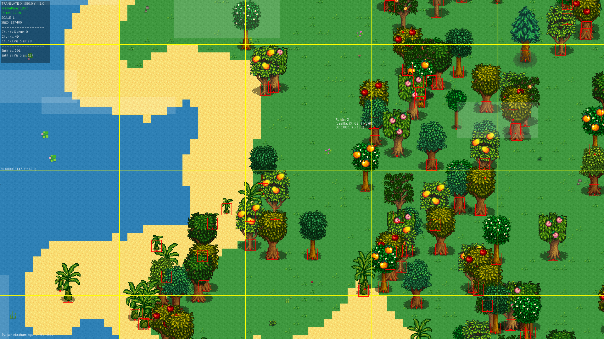
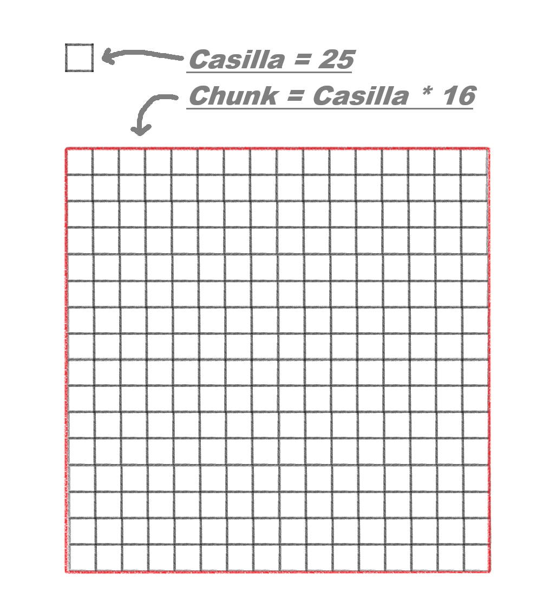

# Objetivo del Proyecto

El objetivo de este proyecto es desarrollar un **algoritmo de generación procedimental de mundos**, permitiendo la creación de entornos dinámicos y únicos de manera automática.  
<p align="center" width="100%">

</p>
*Siempre había querido crear un sistema de este tipo, pero noté que hay poca información disponible en internet. Por eso, este proyecto también busca **compartir el conocimiento y la información que he recopilado con el tiempo**, ayudando a otros interesados en la generación procedimental de mundos.*

---
# Generacion del mundo

## Descripción General

El mundo esta generado medianto Chunks, que son pequeñás porciones del mundo de 16X16 Casillas, esto con el objetivo de cargar de manejar de manera eficiente el mundo, cada casilla tiene un valor definido por el algoritmo de "[Perlin noise](https://es.wikipedia.org/wiki/Ruido_Perlin)".


## casillas
Las casillas representan la unidad mínima del mundo, donde cada una recibe un valor generado por el ruido de Perlin. Cada casilla corresponde a un único píxel dentro del mapa de ruido y, al mismo tiempo, define su propio identificador (IDcasilla).

Para obtener el ID de una casilla, es necesario convertir las coordenadas del mundo en la posición discreta de la casilla dentro de la cuadrícula. Esto se logra dividiendo la posición (pos_X, pos_Y) entre el tamaño de una casilla (CASILLA), como se muestra en la siguiente función:
```python
def IDcasilla(pos_X, pos_Y): 
    """Calcula el chunk en el que se encuentra una posicion"""
    return (pos_X//CASILLA, pos_Y//CASILLA)
```
Esta función devuelve una tupla **(ID_X, ID_Y)**, donde:

   • **ID_X** es la coordenada X de la casilla dentro de la cuadrícula.
   
   • **ID_Y** es la coordenada Y de la casilla dentro de la cuadrícula.

El uso de **//** *(división entera)* asegura que cualquier posición dentro de los límites de una casilla pertenezca al mismo ID, permitiendo mapear el espacio continuo del mundo a una cuadrícula discreta.


, usa valores decimales desde 0 hasta 1, por lo que asignaremos un valor para cada tipo de casilla que queremos crear, en mi caso usare el valor mas bajo para el agua, despues una pequeña porcion de arena para simular las playas e inmediatamente la tierra, seguido de la piedra y finalmente la nieve como valor mas alto.

```python
def ruidoInCasilla(casillaID):
    ruido = noise((valorA + casillaID[0]) / escala, (valorA + casillaID[1]) / escala)
    i = 0 
    
    if ruido > 0.66:   i = 4  # Nieve
    elif ruido > 0.62: i = 3  # Piedra 
    elif ruido > 0.39: i = 2  # Tierra
    elif ruido > 0.37: i = 1  # Arena
    else:              i = 0  # Agua
    
    return i
```


<p align="center" width="100%">

</p>


